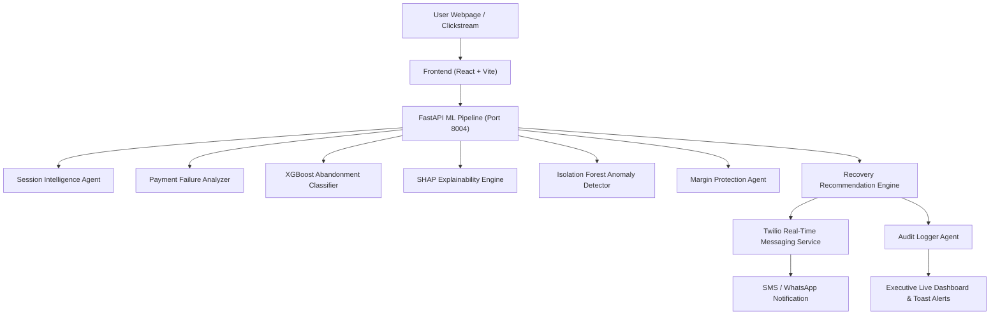

# Cart Rescue AI — Real-Time E-Commerce Cart Recovery & Decision Intelligence Platform

> **AI-Powered Real-Time Abandonment Prevention, Margin Protection, and Automated Twilio Recovery Dispatch.**

---

## 🌟 Executive Overview

**Cart Rescue AI** is an enterprise-grade, real-time decision intelligence platform designed to eliminate e-commerce cart abandonment and maximize revenue recovery without eroding profit margins.

Traditional cart recovery systems rely on static exit popups or delayed email drips. **Cart Rescue AI** evaluates customer clickstream signals, cart modifications, and payment gateway responses in **sub-15 milliseconds**, using a trained **XGBoost Classifier**, **Isolation Forest Anomaly Detector**, **SHAP Explainability**, and **Twilio SMS / WhatsApp Messaging**.

---

## ✨ Key Features

- ⚡ **Sub-15ms Real-Time ML Pipeline**: Predicts checkout abandonment probability in real time.
- 🧠 **Multi-Agent Decision Architecture**: 6 specialized micro-agents:
  1. **Session Intelligence Agent**: Analyzes clickstream velocity and engagement scores.
  2. **Payment Failure Analyzer**: Detects gateway timeouts, card declines, and bank server errors.
  3. **Anomaly Detector (Isolation Forest)**: Flags bot traffic and fraud to prevent coupon abuse.
  4. **Margin Protection Agent**: Enforces strict discount caps based on product profit margins.
  5. **Recovery Recommendation Engine**: Selects the optimal recovery action (`RETRY_PAYMENT`, `COUPON_10`, `FREE_SHIPPING`, `DO_NOTHING`).
  6. **Audit Logger Agent**: Maintains immutable compliance logs for every session prediction.
- 📱 **Twilio Real-Time Messaging (SMS & WhatsApp)**: Dispatches recovery messages with 1-click Razorpay payment retry links, discount promo codes (`SAVE10`), and free shipping triggers.
- 🛍️ **Interactive Webpage Storefront Demo**: Test real-time inputs across 4 checkout stages (`1. Cart View`, `2. Shipping Address`, `3. Payment Gateway`, `4. Order Complete`).
- 📊 **Executive ROI Dashboard**: Displays live revenue lift, discount spend saved, top SHAP risk factors, and real-time session telemetry.

---

## ⚙️ Architecture & Pipeline Flow



---

## 📱 Twilio Setup & The `setup_twilio.bat` Script

The repository includes an automated batch setup script: **`setup_twilio.bat`**.

### What `setup_twilio.bat` Does:
1. **Dependency Installation**: Automatically installs the Twilio Python SDK (`twilio`) and environment parser (`python-dotenv`) using `pip`.
2. **Environment File Generation**: Creates or updates `ml-service/.env` with required configuration keys.
3. **Interactive Configuration Wizard**: Prompts you for:
   - **Twilio Account SID** (e.g., `ACxxxxxxxxxxxxxxxxxxxxxxxxxxxxxxxx`)
   - **Twilio Auth Token** (e.g., `your_auth_token_here`)
   - **Twilio From Phone Number** (e.g., `+18005550199` or `whatsapp:+14155238886`)
   - **Target Destination Phone Number** (e.g., `+919876543210`)
4. **Resilient Fallback Mode**: If live Twilio keys are not provided, the system automatically runs in **Demo Simulation Mode**, generating real-time message SIDs (`SM...`), previews, and dispatch logs without breaking the presentation demo!

### Running the Setup Batch File:
Double-click `setup_twilio.bat` or run it from Command Prompt / PowerShell:
```cmd
setup_twilio.bat
```

---

## 🚀 Quick Start & Local Setup

### Prerequisites
- **Node.js** (v18+)
- **Python** (3.10+)

### 1. Launch ML Service Backend
```bash
cd ml-service
python run_server.py
```
*The ML Service starts on `http://localhost:8004`.*

### 2. Launch Frontend Dev Server
```bash
cd frontend
npm install
npm run dev
```
*The Web Application starts on `http://localhost:5173`.*

---

## 🎯 Demo & Checkout Stage Triggers

Open **[http://localhost:5173/store](http://localhost:5173/store)** to test real-time triggers:

| Stage | Trigger Scenario | Abandonment Risk | Intent | AI Recovery Action | Twilio Alert |
|---|---|---|---|---|---|
| **1. Cart View** | Price Comparison Browsing | **78.5% HIGH** | `PRICE_COMPARISON` | **10% Coupon** (`COUPON_10`) | SMS / WhatsApp promo code (`SAVE10`) |
| **1. Cart View** | Cart Idle (3 Mins) | **68.0% HIGH** | `GENUINE_PURCHASE` | **5% Coupon** (`COUPON_5`) | SMS recovery alert |
| **2. Address** | Address Form Hesitation | **68.1% HIGH** | `GENUINE_PURCHASE` | **Free Shipping** (`FREE_SHIPPING`) | Free shipping activation link |
| **2. Address** | Delivery Fee Hesitation | **82.0% HIGH** | `GENUINE_PURCHASE` | **Free Shipping** (`FREE_SHIPPING`) | Free shipping activation link |
| **3. Payment** | Simulate UPI Timeout | **94.1% CRITICAL** | `PAYMENT_ISSUE` | **Retry Payment** (`RETRY_PAYMENT`) | 1-Click Razorpay Retry SMS |
| **3. Payment** | Simulate Card Decline | **94.1% CRITICAL** | `PAYMENT_ISSUE` | **Retry Payment** (`RETRY_PAYMENT`) | Card retry link SMS |
| **4. Complete** | Order Confirmed & Placed | **0.0% LOW** | `GENUINE_PURCHASE` | **Do Nothing** (`DO_NOTHING`) | Confirmation alert |

---

## 🔌 API Endpoints

### `POST /predict`
Runs full AI prediction pipeline for a customer session.
```json
{
  "features": {
    "session_id": "sess_live_102849",
    "total_clicks": 18,
    "pages_viewed": 5,
    "time_on_site_seconds": 120,
    "cart_value": 4499,
    "checkout_progress": 1,
    "items_removed": 2,
    "cart_value_changes": 4,
    "payment_failures": 0,
    "time_since_last_action": 120
  }
}
```

### `POST /twilio/send`
Direct real-time Twilio SMS / WhatsApp message dispatch.
```json
{
  "session_id": "sess_live_102849",
  "action_type": "RETRY_PAYMENT",
  "to_number": "+919876543210",
  "is_whatsapp": false
}
```

### `GET /twilio/status`
Returns Twilio API configuration status (`LIVE_TWILIO` vs `DEMO_SIMULATION`).

---

## 👤 Author & Repository

- **Repository**: [https://github.com/MuaazShaik/CartRescue-AI.git](https://github.com/MuaazShaik/CartRescue-AI.git)
- **Author**: **MuaazShaik**
